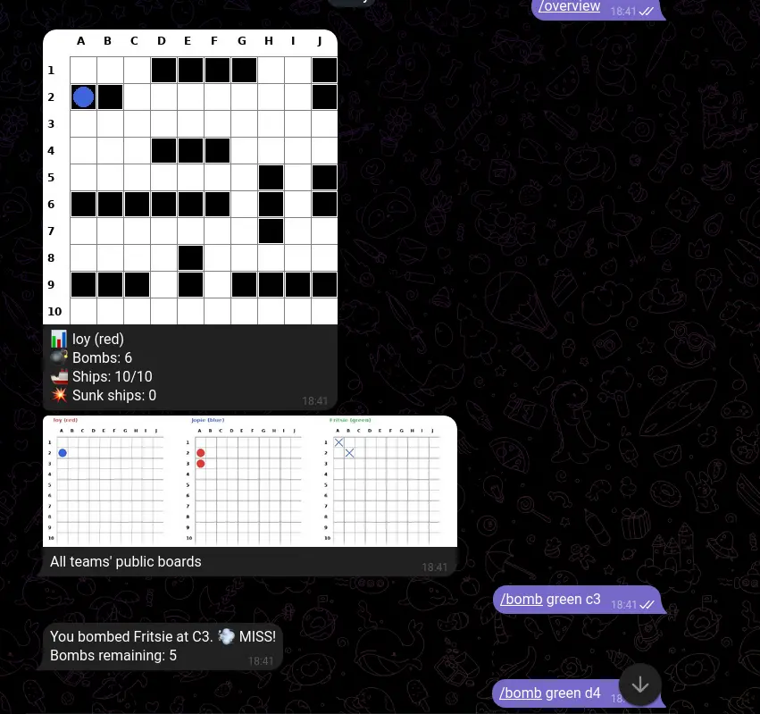
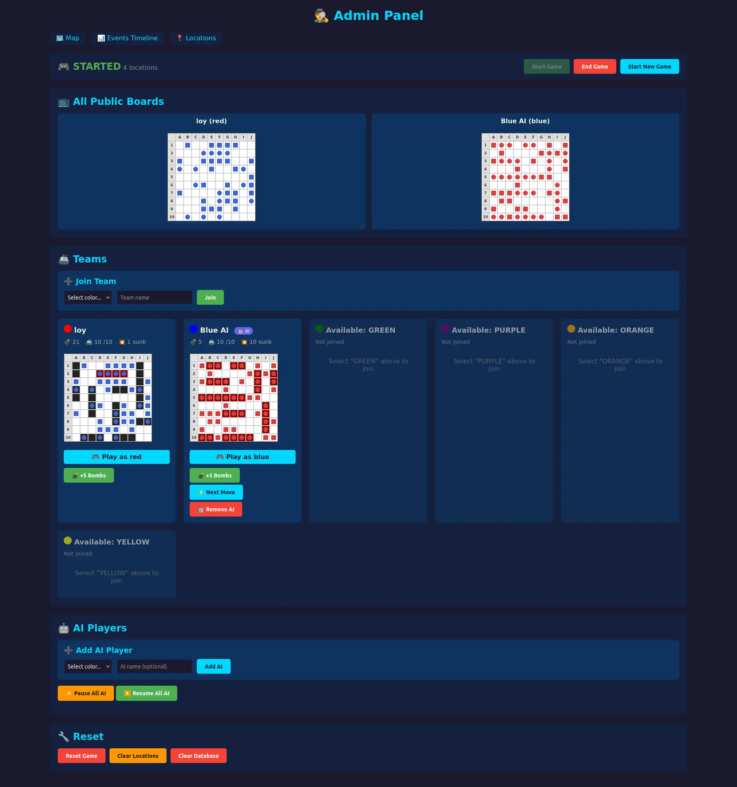
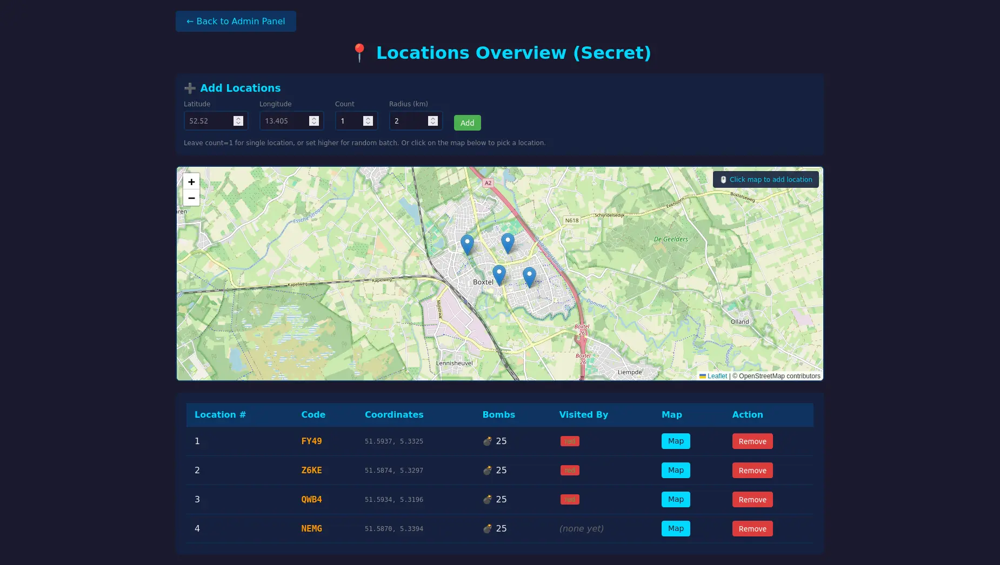

# Live Battlefield

Battleship game played via Telegram with real-life location quests.

## Quick Start

1. Copy `.env.example` to `.env` and add your Telegram Bot Token:
   ```bash
   cp .env.example .env
   # Edit .env and add TELEGRAM_BOT_TOKEN=your_token_here
   ```

2. Start the application with Docker Compose:
   ```bash
   docker compose up --build
   ```

3. The bot will be running and the web API at `http://localhost:8000`

## Commands

### For Players
- `/join <team_name>` - Join the game as a team
- `/leave` - Leave the game (before it starts)
- `/place <ship_type> <coordinate> <direction>` - Place a ship
  - Ship types: `airplane_carrier`, `battleship`, `torpedo_hunter`, `patrol_boat`
  - Coordinates: A1-J10 (e.g., B2)
  - Directions: `horizontal` or `vertical`
- `/placeall` - Place all ships randomly (convenience command)
- `/bomb <team_color> <coordinate>` - Throw a bomb at another team
- `/code <location_number> <code>` - Redeem a code from a location
- `/overview` - View your private board and all public boards
- `/locations` - View all quest locations
- `/aistatus` - View AI player status

### For Game Masters
- `/registergm` - Register as a game master
- Send a location message to add a new quest location
- `/addai <team_color>` - Add an AI player (e.g., `/addai red`)
- `/removeai <team_color>` - Remove an AI player

## Screenshots

### Telegram Bot


### Admin Panel


### Locations Admin


## Web Interface

- `GET /` - API info
- `GET /team` - Team page with interactive board (select color from dropdown)
- `GET /admin` - Admin panel for game control
- `GET /events` - Game events log with timestamps
- `GET /game-state.png` - Current game state as image
- `GET /teams` - List all teams and their status
- `GET /api/board/{color}/public.json` - Public board data as JSON
- `GET /api/board/{color}/private.json` - Private board data as JSON

### Team Page
Players can view their own board and attack other teams through the web interface. Select your team color from the dropdown to see your private board with hit/miss markers.

### Admin Panel
Game masters can:
- Start the game (requires at least 1 location and 2 teams)
- Trigger AI moves
- View all teams and their status
- Monitor game events

## Internet Deployment

Deploy on a home server with a public URL — no open ports, no domain needed.

### Prerequisites

- Docker + Compose installed on your home machine
- Free [ngrok account](https://dashboard.ngrok.com/signup)

### Setup

1. Copy `.env.example` to `.env` and add your tokens:
   ```bash
   cp .env.example .env
   # Edit .env:
   # TELEGRAM_BOT_TOKEN=your_bot_token
   # NGROK_AUTHTOKEN=your_ngrok_authtoken
   ```

2. Start everything:
   ```bash
   docker compose up -d
   ```

3. Get your public URL:
   ```bash
   ./scripts/get-public-url.sh
   # → https://xxxx-xxxx.ngrok-free.app
   ```

4. Share that URL with players for the web UI (team boards, admin panel).

The bot works via polling (outbound to Telegram) — no tunnel needed for it.

### Architecture

```
┌──────────┐    ┌──────────┐    ┌──────────┐
│ postgres │◄───│   app    │───►│  ngrok   │──► internet (HTTPS)
└──────────┘    └──────────┘    └──────────┘
┌──────────┐    (bot polls
│ pgadmin  │     Telegram)
└──────────┘
```

All services are internal to the Docker network. Only ngrok connects outbound. No ports are exposed to the host or router.

## Database Management

### pgAdmin (Database Viewer)

A pgAdmin instance is included for database management.

1. Open http://localhost:5050
2. Login with:
   - Email: admin@example.com
   - Password: admin

3. Add a new server:
   - Name: battleship
   - Host: postgres
   - Port: 5432
   - Username: postgres
   - Password: postgres
   - Database: battleship

## Development

### Running Tests
```bash
python3 -m pytest tests/ -v
```

### Running Locally (without Docker)
```bash
# Install dependencies
uv pip install --system -r pyproject.toml

# Run migrations
alembic upgrade head

# Run the bot and server
python3 -m app.main
```

## Ship Types
- 1x airplane carrier (6 squares)
- 2x battleship (4 squares each)
- 3x torpedo hunter (3 squares each)
- 4x patrol boat (2 squares each)
